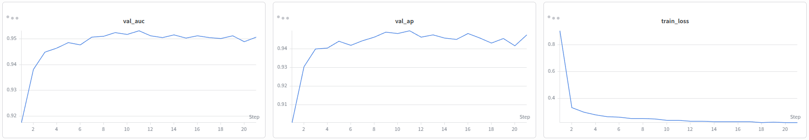
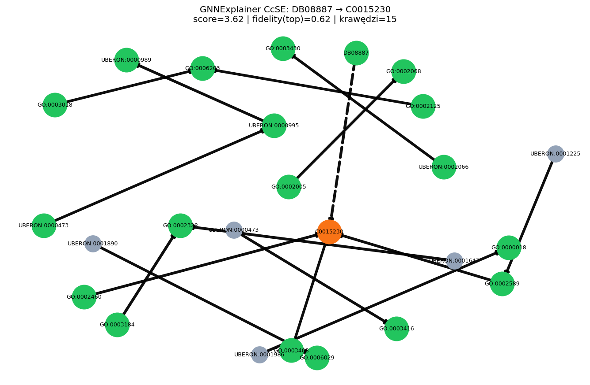
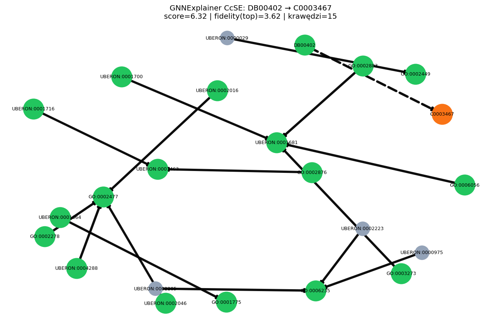

# Raport Końcowy Projektu: Zaawansowane Sieci Neuronowe

**Temat:** Interpretowalność relacyjnych sieci grafowych (RGCN) w zadaniu przewidywania skutków ubocznych leków na grafie wiedzy Hetionet.  
**Autorzy:** Jakub Jażdżyk, Kajetan Rożej  
**Data:** 6.06.2026  

**Repozytorium:** https://github.com/kubajaz/XAI 

---

## 1. Wprowadzenie i kontekst

Współczesna medycyna i farmakologia operują na ogromnych grafach wiedzy łączących leki, geny, choroby i skutki uboczne. Modele grafowe potrafią wykorzystać te powiązania do predykcji brakujących relacji, lecz w zastosowaniach klinicznych i badawczych sama predykcja („lek X powoduje skutek Y”) jest niewystarczająca - potrzebne jest uzasadnienie w postaci ścieżek biologicznych wspierających decyzję modelu.

Niniejszy raport podsumowuje pracę opisaną we wstępnej dokumentacji. W trakcie implementacji **zadanie docelowe zostało zmienione** na relację **CcSE** (*Compound causes Side Effect*) zamiast pierwotnie planowanej relacji CtD (*Compound treats Disease*). W Hetionet v1.0 relacji CcSE jest **138 944**, a CtD tylko **755** - skupiliśmy się więc na predykcji i interpretacji skutków ubocznych, gdzie mamy dużo danych nadzorowanych i sensowne zadanie link prediction.

**Problem badawczy:** Jak skutecznie przewidzieć brakujące krawędzie CcSE na pełnym heterogenicznym grafie Hetionet oraz jak wyekstrahować z predykcji zwięzłe, wierne modelowi podgrafy wyjaśniające?

---

## 2. Cele, hipotezy i pytania badawcze

Celem projektu, zgodnie z założeniami przedstawionymi w raporcie wstępnym była implementacja relacyjnej sieci grafowej (RGCN), która nauczy się semantyki grafu wiedzy Hetionet, a następnie zostanie poddana procesowi interpretacji przy użyciu metod XAI (Explainable AI).

### 2.1. Hipotezy (do weryfikacji wynikami)

1.  **H1 (Relacyjność):** Architektura RGCN, dzięki zastosowaniu osobnych macierzy wag dla każdego typu relacji, jest w stanie odróżnić krawędzie o znaczeniu pozytywnym (terapeutycznym) od negatywnych (skutki uboczne).

   _Po zmianie zadania z CtD na CcSE (pkt. 1) weryfikujemy H1 operacyjnie: czy RGCN wykorzystuje heterogeniczne typy relacji Hetionet do skutecznej predykcji krawędzi CcSE._

2.  **H2 (Redukcja Szumu):** Metoda GNNExplainer pozwoli na wyekstrahowanie z gęstego grafu (tzw. *hairball*) ścieżek o długości 2-3 skoków, które są zrozumiałe dla eksperta i biologicznie poprawne.

**Odpowiedź na hipotezy:** **H1 - TAK** · **H2 - TAK**

**H1:** We wstępnej dokumentacji planowaliśmy relację docelową **CtD** (*Compound treats Disease*). Po analizie danych **zmieniliśmy zadanie na CcSE** (*Compound causes Side Effect*) - w Hetionet jest znacznie więcej krawędzi CcSE niż CtD, więc link prediction i XAI sensownie wykonujemy na skutkach ubocznych. W tym ustawieniu RGCN z osobnymi wagami dla 24 typów relacji osiąga **test AP/AUC ≈ 0,95** na CcSE: model wykorzystuje więc relacyjną strukturę grafu do przewidywania relacji ubocznych. **H1 uznajemy za potwierdzoną** w zakresie przyjętego po pivotcie zadania (predykcja CcSE na pełnym Hetionet).

**H2:** maskowanie top-15 krawędzi obniża score z dodatnią fidelity; podgrafy wyjaśnienia są zwięzłe, ze ścieżkami 2-3-skokowymi od leku do skutku ubocznego.

---

## 3. Zbiór danych i preprocessing

### 3.1. Hetionet v1.0 (baseline)

| Element | Wartość (z dokumentacji wstępnej / po wczytaniu grafu) |
|---------|------------------------------------------------------|
| Węzły (łącznie) | 47 031 (11 typów: Compound, Disease, Gene, …) |
| Krawędzie (łącznie) | 2 250 197 (24 typy relacji) |
| **Relacja docelowa** | **CcSE** - Compound → Side Effect |
| Liczba krawędzi CcSE | **138 944** |
| Liczba leków (Compound) | **1552** |
| Liczba skutków (Side Effect) | **5734** |

### 3.2. Podział danych (link split)

Zgodnie z implementacją `RandomLinkSplit`

| Parametr | Wartość |
|----------|---------|
| `num_val` | 0.1 |
| `num_test` | 0.1 |
| `disjoint_train_ratio` | 0.3 |
| Negatywy w treningu | `neg_sampling_ratio=1.0` |
| Typ krawędzi | wyłącznie `("Compound", "CcSE", "Side Effect")` |

**Liczby par po podziale** (`RandomLinkSplit`, `seed=42`):

| Podział | Pozytywne CcSE (train) | Pary val | Pary test |
|---------|------------------------|----------|-----------|
| Wartości | **33 346** poz. | **27 788** par | **27 788** par |

W podziale walidacyjnym i testowym liczba „par” obejmuje **pozytywne i negatywne** próbki linków CcSE (`edge_label.numel()` w loaderze). W treningu stosujemy `neg_sampling_ratio=1.0` (261 batchy/epokę przy `batch_size=128`).

### 3.3. Ilustracja danych

_Rysunek 1: fragment grafu Hetionet (BFS wokół przykładowej krawędzi; pełny graf jest zbyt gęsty do jednej ilustracji)._

_Podgraf wyjaśnienia GNNExplainer - §7.3._

---

## 4. Architektura i implementacja

### 4.1. Model predykcyjny

| Składnik | Opis | Plik |
|----------|------|------|
| Encoder | 2-warstwowy RGCN (`HeteroConv` + `RGCNConv`, agregacja `mean` → `sum`) | `src/model.py` |
| Embeddingi węzłów | `nn.Embedding` per typ węzła | `src/model.py` |
| Decoder | DistMult - iloczyn skalarny z wektorem relacji | `src/model.py` |
| Funkcja straty | `binary_cross_entropy_with_logits` | `src/train_utils.py` |
| Inferencja minibatch | `LinkNeighborLoader` | `src/train_utils.py` |

### 4.2. Moduł XAI

| Element | Opis |
|---------|------|
| Algorytm | `GNNExplainer` (PyG `Explainer`) |
| Wrapper | `CcSEExplainWrapper` - regresja na krawędzi CcSE |
| Podgraf | ten sam `num_neighbors` co w treningu |
| Ranking | `top_k` krawędzi wg `edge_mask` |
| Fidelity | spadek score po zamaskowaniu top-k **ważnych** krawędzi |
| Wyjście | `outputs/explanation_gnn.png`, logi W&B (`job_type=explain`) |

---

## 5. Eksperymenty

### 5.1. Trening

- **Środowisko:** klaster Athena, Linux, Python 3.11, PyTorch 2.11 + CUDA 12.8, GPU **NVIDIA A100-SXM4-40GB**.
- **Siatka hiperparametrów** (`scripts/slurm/train_grid.sh`): wymiary embeddingu `{64, 256, 512}`, batch `{128, 256}`, lr `{1e-2, 1e-3, 1e-4}`, weight decay `{1e-6, 1e-5}`, sąsiedztwo `{15 10, 20 15, 10 5}` - łącznie **144 runy**.
- **Kryterium wyboru modelu:** najwyższa **best_val_ap** na zbiorze walidacyjnym.
- **Metryki raportowane:** AUC-ROC, AP (val i test po wczytaniu najlepszego checkpointu).
- **Run referencyjny (najlepszy run siatki):** `grid-2654489_4_bs128_dim64_lr1e-2_wd1e-5_nh15-10` (W&B `r4nyt104`) - czas **4 min 25 s**.

### 5.2. Wyjaśnienia (XAI)

Dla każdej analizowanej pary (Compound, Side Effect):

| Parametr | Wartość w eksperymencie |
|----------|-------------------------|
| Podział (`--split`) | `test` |
| `explainer_epochs` | `100` |
| `top_k` | `15` |

**Przypadki do omówienia jakościowo**:

| # | Lek (nazwa / ID) | Skutek uboczny | Split |
|---|------------------|----------------|-------|
| 1 | DB08887 (`compound=1483`) | C0015230 (`side_effect=510`) | test |
| 2 | DB00402 (`compound=280`) | C0003467 (`side_effect=98`) | test |

---

## 6. Wyniki treningu

### 6.1. Najlepszy run siatki - wykres uczenia (W&B `r4nyt104`)

Run z **najwyższym `best_val_ap`** w siatce 144 konfiguracji. Checkpoint: `grid_2654489_4_bs128_dim64_lr1e-2_wd1e-5_nh15-10.pth`.

Hiperparametry: `batch_size=128`, `embed_dim=64`, `lr=1e-2`, `weight_decay=1e-5`, `num_neighbors=[15, 10]`, `epochs=50`, `patience=10`, `seed=42`.

**Metryki predykcji** (checkpoint z epoki 11; test po wczytaniu najlepszego modelu):

| Metryka | Walidacja (najlepsza epoka) | Walidacja (checkpoint wczytany po treningu) | Test |
|---------|----------------------------|-------------------------------|------|
| **AUC-ROC** | 0,9532 | 0,9532 | 0,9528 |
| **AP** | 0,9498 | 0,9492 | 0,9485 |

**Parametry przebiegu treningu:**

| Parametr | Wartość |
|----------|---------|
| Epoka najlepszego checkpointu | 11 |
| Early stopping | tak - brak poprawy val AP przez 10 epok (zatrzymano w epoce 21) |
| Czas treningu | 4 min 25 s |
| Urządzenie | CUDA, NVIDIA A100-SXM4-40GB (węzeł `t0014`) |

**Krzywe uczenia** (W&B, run `r4nyt104`):

Model szybko zbiega (val AUC/AP rosną głównie w epokach 1-11). Końcowy `train_loss` = 0,218. Metryki testowe są bliskie walidacyjnym (różnica AP < 0,002).

### 6.2. Siatka hiperparametrów

Pełna siatka obejmuje 144 runy. Poniżej **4 runy z najwyższym `best_val_ap`** oraz wybrany run z niższym lr (`lr1e-3`) do porównania.

| Run (tag) | bs | dim | lr | wd | neighbors | Best Val AP | Best Val AUC | Test AP | Test AUC | Uwagi |
|-----------|-----|-----|-----|-----|-----------|--------|---------|---------|----------|-------|
| `grid-2654489_4_…_lr1e-2_…_nh15-10` | 128 | 64 | 1e-2 | 1e-5 | 15, 10 | 0,9498 | 0,9532 | 0,9485 | 0,9528 | **najlepszy** - run z §6.1, W&B `r4nyt104` |
| `grid-2654489_5_…_lr1e-2_…_nh20-15` | 128 | 64 | 1e-2 | 1e-5 | 20, 15 | 0,9497 | 0,9528 | 0,9461 | 0,9507 | |
| `grid-2654493_11_…_dim128_lr1e-3_…` | 128 | 128 | 1e-3 | 1e-5 | 20, 15 | 0,9494 | 0,9494 | 0,9462 | 0,9468 | większy `embed_dim`, niższy test AUC |
| `grid-2654489_6_…_lr1e-2_…_nh10-5` | 128 | 64 | 1e-2 | 1e-5 | 10, 5 | 0,9493 | 0,9509 | 0,9486 | 0,9508 | mniejsze sąsiedztwo |
| `grid-2654489_10_…_lr1e-3_…_nh15-10` | 128 | 64 | 1e-3 | 1e-5 | 15, 10 | 0,9487 | 0,9503 | 0,9478 | 0,9501 | porównawczy: ten sam układ hiperparametrów, `lr=1e-3` (W&B `f78fxjqw`) |
| `grid-2654496_4_…_dim512_lr1e-2_…` | 128 | **512** | 1e-2 | 1e-5 | 15, 10 | **0,6909** | 0,7273 | 0,6928 | 0,7244 | **najniższe `best_val_ap`** w siatce |

### 6.3. Analiza wyników predykcji

W siatce najlepsze runy osiągają test AP/AUC ≈ 0,95 przy `embed_dim` 64-128; najgorszy run (`embed_dim=512`, ten sam `lr` i sąsiedztwo) ma test AP ≈ 0,693 i test AUC ≈ 0,724 - nadal powyżej losowego (0,5), ale wyraźnie poniżej najlepszych konfiguracji.

**Wnioski (trening):** RGCN + DistMult na Hetionet z neighbor sampling osiąga test AP/AUC ≈ **0,948 / 0,953** (najlepszy run §6.1). Najlepsza konfiguracja: `embed_dim=64`, `lr=1e-2`, batch 128. Trening trwa kilka minut na A100 (np. 4,5 min dla runu referencyjnego). Metryki testowe są bliskie walidacyjnym.

---

## 7. Wyniki interpretowalności (XAI)

### 7.1. Metryki ilościowe XAI

| # | Para (lek → skutek) | Score | Score po mask. top-k | Fidelity Δ | Węzły | Krawędzie |
|---|---------------------|-------|----------------------|------------|-------|-----------|
| 1 | DB08887 → C0015230 | 3,621 | 2,997 | 0,624 | 88 | 90 |
| 2 | DB00402 → C0003467 | 6,323 | 2,700 | 3,623 | 82 | 86 |

### 7.2. Top-k krawędzi

#### 7.2.1. DB08887 → C0015230

| Rank | Waga | Typ źr. | Relacja | Typ celu | Źródło (ID) | Cel (ID) |
|------|------|---------|---------|----------|-------------|----------|
| 1 | 0,837 | Compound | CrC | Compound | GO:0003184 | GO:0002328 |
| 2 | 0,817 | Compound | CrC | Compound | UBERON:0000995 | UBERON:0000989 |
| 3 | 0,814 | Pharmacologic Class | PCiC | Compound | UBERON:0001647 | GO:0002328 |
| 4 | 0,814 | Compound | CcSE | Side Effect | GO:0002460 | GO:0000491 |
| 5 | 0,805 | Pharmacologic Class | PCiC | Compound | UBERON:0000473 | GO:0003416 |
| 6 | 0,800 | Compound | CcSE | Side Effect | GO:0002589 | GO:0000491 |
| 7 | 0,798 | Compound | CrC | Compound | GO:0002005 | GO:0002068 |
| 8 | 0,797 | Pharmacologic Class | PCiC | Compound | UBERON:0001890 | GO:0006029 |
| 9 | 0,794 | Compound | CrC | Compound | UBERON:0002066 | GO:0003430 |
| 10 | 0,787 | Pharmacologic Class | PCiC | Compound | UBERON:0001225 | GO:0002589 |
| 11 | 0,786 | Pharmacologic Class | PCiC | Compound | UBERON:0001986 | GO:0000018 |
| 12 | 0,782 | Compound | CrC | Compound | UBERON:0000473 | UBERON:0000995 |
| 13 | 0,776 | Compound | CrC | Compound | GO:0003018 | GO:0006203 |
| 14 | 0,772 | Compound | CrC | Compound | GO:0002125 | GO:0006203 |
| 15 | 0,765 | Compound | CcSE | Side Effect | GO:0003408 | GO:0000491 |

W top-15 dominują relacje CrC, PCiC, oraz CcSE.

#### 7.2.2. DB00402 → C0003467

| Rank | Waga | Typ źr. | Relacja | Typ celu | Źródło (ID) | Cel (ID) |
|------|------|---------|---------|----------|-------------|----------|
| 1 | 0,828 | Compound | CrC | Compound | UBERON:0004288 | GO:0002477 |
| 2 | 0,823 | Compound | CrC | Compound | GO:0002883 | UBERON:0001681 |
| 3 | 0,812 | Compound | CrC | Compound | GO:0006056 | UBERON:0001681 |
| 4 | 0,808 | Compound | CrC | Compound | GO:0002278 | GO:0002477 |
| 5 | 0,805 | Pharmacologic Class | PCiC | Compound | UBERON:0002223 | GO:0006235 |
| 6 | 0,804 | Compound | CrC | Compound | GO:0003273 | UBERON:0001681 |
| 7 | 0,804 | Pharmacologic Class | PCiC | Compound | UBERON:0002205 | GO:0006235 |
| 8 | 0,803 | Compound | CrC | Compound | UBERON:0002016 | GO:0002477 |
| 9 | 0,797 | Compound | CrC | Compound | UBERON:0001064 | GO:0001775 |
| 10 | 0,786 | Pharmacologic Class | PCiC | Compound | UBERON:0000975 | GO:0006235 |
| 11 | 0,781 | Pharmacologic Class | PCiC | Compound | UBERON:0000029 | GO:0002449 |
| 12 | 0,781 | Compound | CrC | Compound | UBERON:0002046 | GO:0002477 |
| 13 | 0,777 | Compound | CrC | Compound | GO:0002876 | UBERON:0001463 |
| 14 | 0,777 | Compound | CrC | Compound | UBERON:0001716 | UBERON:0001463 |
| 15 | 0,777 | Compound | CrC | Compound | UBERON:0001700 | UBERON:0001681 |

W top-15 dominują relacje CrC oraz PCiC.

### 7.3. Wizualizacje

**Przypadek 1** - DB08887 → C0015230 (W&B `zxt0cktp`; score 3,62; fidelity 0,62):

**Przypadek 2** - DB00402 → C0003467 (W&B `d1x13eu1`; score 6,32; fidelity 3,62):

Na obu wykresach widać 15 ważnych krawędzi, węzeł leku, węzeł skutku (pomarańczowy) oraz pośrednie węzły. Szare węzły odpowiadają klasom farmakologicznym (PCiC).

### 7.4. Ocena jakościowa

GNNExplainer nadaje wagi **każdej** krawędzi podgrafu z neighbor loadera (86-90 krawędzi, §7.1). W raporcie pokazujemy **15 krawędzi z najwyższymi wagami** - parametr `top_k=15` to **próg wizualizacji**.

Czy wybrane krawędzie mają znaczenie dla modelu, sprawdzamy **fidelity**: o ile spada score predykcji po ich zamaskowaniu. W obu parach fidelity > 0 (§7.1).

| | DB08887 → C0015230 | DB00402 → C0003467 |
|---|-------------------|-------------------|
| Krawędzie w podgrafie | 90 | 86 |
| Fidelity | 0,624 | 3,623 |
| Główne typy relacji w top-k | CrC, PCiC, CcSE | CrC, PCiC |

Wizualizacje (§7.3) są czytelne - węzeł leku, skutku i pośrednie węzły połączone w krótkich ścieżkach. Fidelity różni się między parami (0,62 vs 3,62), więc ranking krawędzi zależy od konkretnej pary lek-skutek.

**Wnioski (XAI):** Explainer rankinguje ok. 90 krawędzi; top-15 to skrót do prezentacji. Dodatnia fidelity uzasadnia, że te krawędzie wpływają na predykcję modelu. **H2 - TAK** (zwięzłe wyjaśnienia w §7.3, potwierdzone fidelity).

---

## 8. Ograniczenia i ryzyka (aktualizacja)

| Ryzyko (wstępne) | Obserwacja po implementacji |
|------------------|----------------------------|
| Zużycie VRAM na pełnym grafie | **Rozwiązane** - `LinkNeighborLoader` + `num_neighbors` umożliwiły trening na A100 w kilku minutach na konfigurację |
| Niestabilność GNNExplainer | Różne `fidelity` między parami (np. 0,62 vs 3,62 przy tym samym `top_k`) - wrażliwość na parę lek-skutek |
| Rozbieżność split train/test w XAI | Wyjaśnienia używają **tego samego** `RandomLinkSplit` i `seed` co trening |
| Brak MRR | Ranking globalny nie był celem minimalnej implementacji |

**Inne ograniczenia:** jedna warstwa RGCN i jeden algorytm XAI (GNNExplainer); brak walidacji klinicznej wyjaśnień; duża zmienność fidelity między parami przy stałym `top_k`.

---

## 9. Wyniki

1. Model RGCN osiągnął na zbiorze testowym **AP = 0,948** i **AUC = 0,953** dla relacji CcSE (najlepszy run siatki hiperparametrów).  
2. GNNExplainer: maskowanie top-15 krawędzi obniża score w obu parach (fidelity **0,62** i **3,62**).  
3. **H1 (potwierdzona):** po zmianie relacji docelowej z **CtD** na **CcSE** RGCN osiąga AP/AUC ≈ 0,95 - model wykorzystuje heterogeniczne typy krawędzi Hetionet do predykcji skutków ubocznych.  
4. **H2 (potwierdzona):** explainer rankinguje pełny podgraf (~90 krawędzi); top-15 + dodatnia fidelity dają zwięzłe, wierne modelowi wyjaśnienia.  

---

## 10. Wnioski końcowe

Projekt zrealizował pełny pipeline: preprocessing Hetionet, trening RGCN + DistMult na relacji CcSE, siatkę hiperparametrów na klastrze oraz interpretację wybranych predykcji przez GNNExplainer z logowaniem do W&B.

**Predykcja.** Po zmianie zadania z CtD na CcSE model osiągnął test AP/AUC ok. **0,95** - RGCN wykorzystuje heterogeniczną strukturę grafu (24 typy relacji) do przewidywania skutków ubocznych. Siatka 144 runów pokazała, że wystarczają umiarkowane embeddingi (64-128) i neighbor sampling; konfiguracja z `embed_dim=512` przy tym samym lr wyraźnie gorsza (~0,69 AP), co warto mieć na uwadze przy dalszym tuningu.

**Interpretowalność.** Dla dwóch par testowych (DB08887 → C0015230, DB00402 → C0003467) explainer nadał wagi wszystkim krawędziom podgrafu (~86-90), a w raporcie pokazaliśmy top-15. Dodatnia **fidelity** w obu przypadkach oznacza, że wybrane krawędzie wpływają na score modelu - wyjaśnienie jest wierne modelowi, nie tylko krótkie. Wizualizacje (§7.3) są czytelne; skład top-k różni się między parami (np. obecność krawędzi CcSE u pierwszej pary, dominacja CrC/PCiC u drugiej).

**Hipotezy.** **H1 - TAK** w zakresie przyjętego zadania (predykcja CcSE na pełnym Hetionet). **H2 - TAK** - zwięzła prezentacja wyjaśnień i potwierdzenie przez fidelity; nie ocenialiśmy klinicznej poprawności ścieżek przez eksperta medycznego.

**Ograniczenia i dalsza praca.** Wyjaśnienia zależą od `top_k` i są wrażliwe na parę lek-skutek (fidelity 0,62 vs 3,62). Naturalnym rozszerzeniem byłaby walidacja przez eksperta, mapowanie ID ontologii na nazwy oraz test innych algorytmów XAI.

---

## 11. Bibliografia

1. Schlichtkrull, M., et al. (2018). *Modeling Relational Data with Graph Convolutional Networks*. ESWC.  
2. Ying, R., et al. (2019). *GNNExplainer: Generating Explanations for Graph Neural Networks*. NeurIPS.  
3. Himmelstein, D. S., et al. (2017). *Systematic integration of biomedical knowledge prioritizes drugs for repurposing*. eLife. (Hetionet)  
4. Wójcik, F. *Grafowe sieci neuronowe*.  
5. Kuhn, M., et al. (2016). *The SIDER database of drugs and side effects*. Nucleic Acids Research. (źródło relacji CcSE w Hetionet)